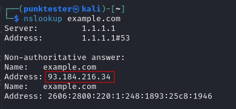

# Host Discovery

## Getting IP from domain

### Nslookup

<div align="left">

<figure><figcaption></figcaption></figure>

</div>

**Basic Command**

```
nslookup example.com
```

### Ping

<div align="left">

<figure><figcaption></figcaption></figure>

</div>

**Basic Command**

```
ping example.com
```


## Discovery

### Nmap



<div align="left">

<figure><figcaption></figcaption></figure>

</div>

**Basic Command**

```
nmap -sn 1.1.1.0/24
```

### Fping



<div align="left">

<figure><figcaption></figcaption></figure>

</div>

**Basic Command**

```
ping -a -g 1.1.1.0/24 
```

**Only show alive ip**

```
ping -a -g 1.1.1.0/24 2>/dev/null
```

### Reverse DNS (identify hostname)

```
nmap -sL 1.1.1.1
```

## Related Article&#x20;






